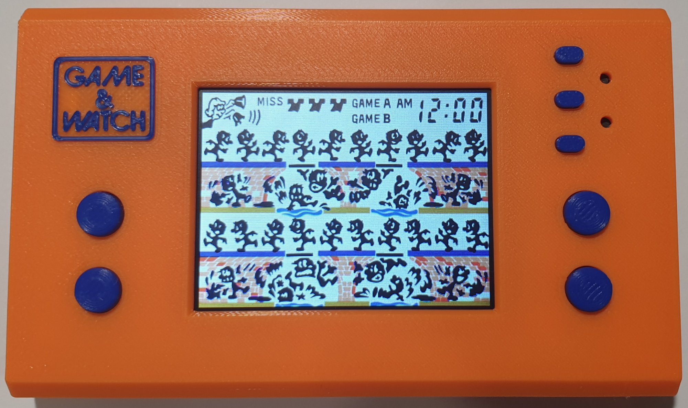
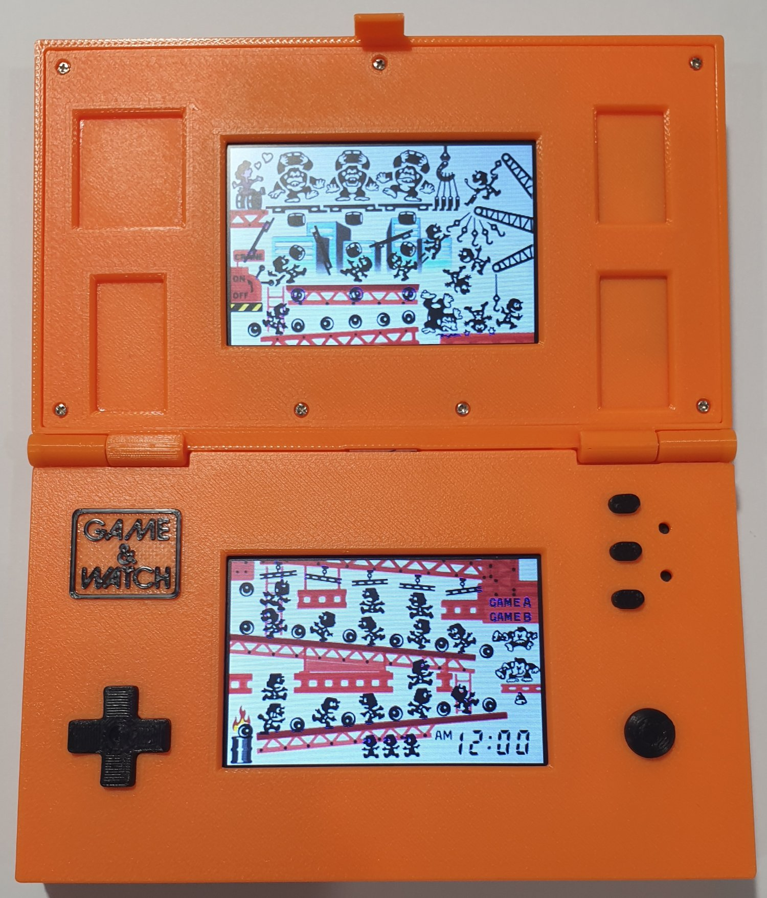

# Esp32-Game-and-Watch

Esp32‑Game‑and‑Watch is a project for recreating classic Game & Watch handhelds using an ESP32 microcontroller, 3D‑printed cases, and simple electronics. 

It currently supports most single screen and multi screen Game & Watch titles, making it easy to recreate a wide range of the original handhelds.

<table>
<tr>
<td><strong>Demo</strong></td>
</tr>
<tr>
<td>
	
<strong>Single Screen</strong>

	

	
<a href="https://github.com/slowlane112/Esp32-Game-and-Watch/tree/main/gandw_single_screen">https://github.com/slowlane112/Esp32-Game-and-Watch/tree/main/gandw_single_screen</a>

</td>
</tr>
<tr>
<td>
	
<strong>Multi Screen</strong>

	

	
<a href="https://github.com/slowlane112/Esp32-Game-and-Watch/tree/main/gandw_multi_screen">https://github.com/slowlane112/Esp32-Game-and-Watch/tree/main/gandw_multi_screen</a>

</td>	
</tr>
</table>

 

<table>
<tr>
<td><strong>Single Screen Handheld</strong></td>
</tr>
<tr>
<td>
	
<strong>2 Buttons</strong>

	

	
<a href="https://github.com/slowlane112/Esp32-Game-and-Watch/tree/main/gandw_single_screen_handheld">https://github.com/slowlane112/Esp32-Game-and-Watch/tree/main/gandw_single_screen_handheld</a>

</td>
</tr>
<tr>
<td>
	
<strong>4 Buttons</strong>

	

	
<a href="https://github.com/slowlane112/Esp32-Game-and-Watch/tree/main/gandw_single_screen_4button_handheld">https://github.com/slowlane112/Esp32-Game-and-Watch/tree/main/gandw_single_screen_4button_handheld</a>

</td>	
</tr>
</table>

 

<table>
<tr>
<td><strong>Multi Screen Handheld</strong></td>
</tr>
<tr>
<td>
	
<strong>2 Buttons</strong>

	

	
<a href="https://github.com/slowlane112/Esp32-Game-and-Watch/tree/main/gandw_multi_screen_handheld">https://github.com/slowlane112/Esp32-Game-and-Watch/tree/main/gandw_multi_screen_handheld</a>

</td>
</tr>
<tr>
<td>
	
<strong>D-pad</strong>

	

	
<a href="https://github.com/slowlane112/Esp32-Game-and-Watch/tree/main/gandw_multi_screen_dpad_handheld">https://github.com/slowlane112/Esp32-Game-and-Watch/tree/main/gandw_multi_screen_dpad_handheld</a>

</td>	
</tr>
</table>

 

<table>
<tr>
<td><strong>CardPuter</strong></td>
</tr>
<tr>
<td>
	
<strong>Single Screen</strong>

	

	
<a href="https://github.com/slowlane112/Esp32-Game-and-Watch/tree/main/gandw_cardputer">https://github.com/slowlane112/Esp32-Game-and-Watch/tree/main/gandw_cardputer</a>

</td>
</tr>
<tr>
<td>
	
<strong>Multi Screen</strong>

	

	
<a href="https://github.com/slowlane112/Esp32-Game-and-Watch/tree/main/gandw_cardputer_multi_screen">https://github.com/slowlane112/Esp32-Game-and-Watch/tree/main/gandw_cardputer_multi_screen</a>

</td>
</tr>
</table>
