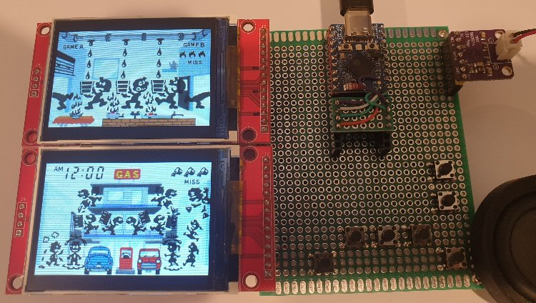
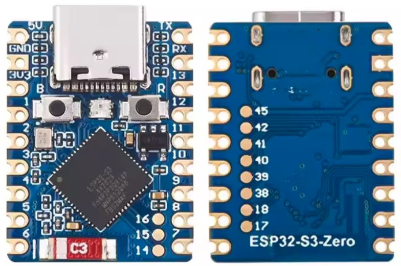
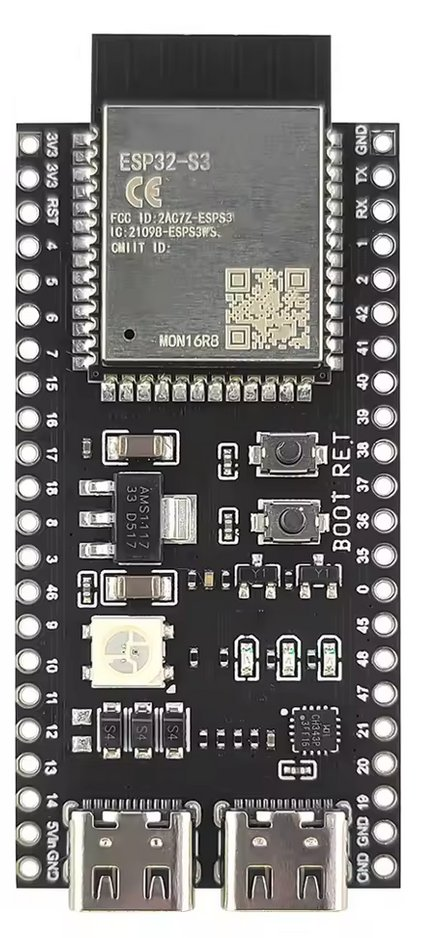
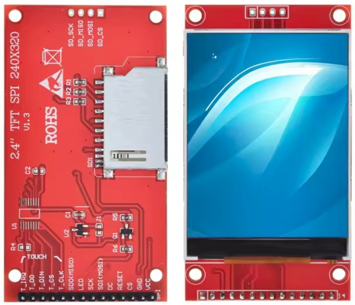
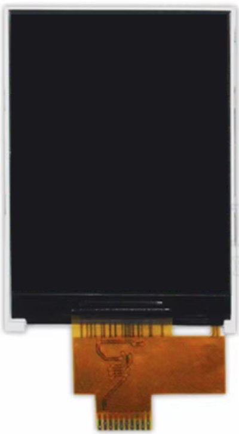
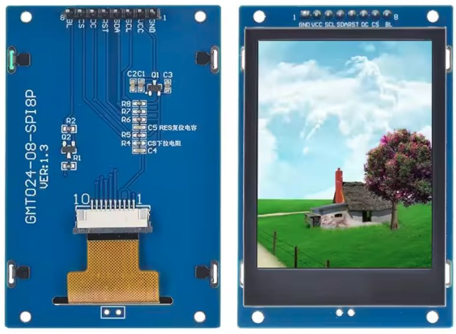

# Esp32-Game-and-Watch

Esp32‑Game‑and‑Watch is a project for recreating classic Game & Watch handhelds using an ESP32 microcontroller, 3D‑printed cases, and simple electronics. 

It currently supports most single screen and multi screen Game & Watch titles, making it easy to recreate a wide range of the original handhelds.

## Latest Updates

- Updated the codebase to work with ESP‑IDF 6.0
- Added support for ST7789V LCD screens

<table>
<tr>
<td><strong>Demos</strong></td>
</tr>
<tr>
<td>
	
<strong>Single Screen</strong>

	

	
<a href="https://github.com/slowlane112/Esp32-Game-and-Watch/tree/main/gandw_demo_single_screen">https://github.com/slowlane112/Esp32-Game-and-Watch/tree/main/gandw_demo_single_screen</a>

</td>
</tr>
<tr>
<td>
	
<strong>Multi Screen</strong>

	

	
<a href="https://github.com/slowlane112/Esp32-Game-and-Watch/tree/main/gandw_demo_multi_screen">https://github.com/slowlane112/Esp32-Game-and-Watch/tree/main/gandw_demo_multi_screen</a>

</td>	
</tr>
</table>

 

<table>
<tr>
<td><strong>Single Screen Handhelds</strong></td>
</tr>
<tr>
<td>
	
<strong>2 Buttons</strong>

	

	
<a href="https://github.com/slowlane112/Esp32-Game-and-Watch/tree/main/gandw_handheld/README-single_screen_2_button.md">https://github.com/slowlane112/Esp32-Game-and-Watch/tree/main/gandw_handheld/README-single_screen_2_button.md</a>

</td>
</tr>
<tr>
<td>
	
<strong>4 Buttons</strong>

	

	
<a href="https://github.com/slowlane112/Esp32-Game-and-Watch/tree/main/gandw_handheld/README-single_screen_4_button.md">https://github.com/slowlane112/Esp32-Game-and-Watch/tree/main/gandw_handheld/README-single_screen_4_button.md</a>

</td>	
</tr>
</table>

 

<table>
<tr>
<td><strong>Multi Screen Handhelds</strong></td>
</tr>
<tr>
<td>
	
<strong>2 Buttons</strong>

	

	
<a href="https://github.com/slowlane112/Esp32-Game-and-Watch/tree/main/gandw_handheld/README-multi_screen_2_button.md">https://github.com/slowlane112/Esp32-Game-and-Watch/tree/main/gandw_handheld/README-multi_screen_2_button.md</a>

</td>
</tr>
<tr>
<td>
	
<strong>D-pad</strong>

	

	
<a href="https://github.com/slowlane112/Esp32-Game-and-Watch/tree/main/gandw_handheld/README-multi_screen_dpad.md">https://github.com/slowlane112/Esp32-Game-and-Watch/tree/main/gandw_handheld/README-multi_screen_dpad.md</a>

</td>	
</tr>
</table>

 

<table>
<tr>
<td><strong>Cardputer</strong></td>
</tr>
<tr>
<td>
	
<strong>Single Screen - Cardputer v1.1 and Cardputer Adv.</strong>

	

	
<a href="https://github.com/slowlane112/Esp32-Game-and-Watch/tree/main/gandw_cardputer/README-cardputer.md">https://github.com/slowlane112/Esp32-Game-and-Watch/tree/main/gandw_cardputer/README-cardputer.md</a>

</td>
</tr>
<tr>
<td>
	
<strong>Multi Screen - Cardputer Adv.</strong>

	

	
<a href="https://github.com/slowlane112/Esp32-Game-and-Watch/tree/main/gandw_cardputer/README-cardputer_multi_screen.md">https://github.com/slowlane112/Esp32-Game-and-Watch/tree/main/gandw_cardputer/README-cardputer_multi_screen.md</a>

</td>
</tr>
</table>

# Hardware Overview

## ESP32-S3

The project runs on an ESP32‑S3 development board. For handheld builds, the design uses the compact ESP32‑S3 Zero development board.

<table>
<tr>
    <td></td>
    <td></td>
</tr>
<tr>
    <td>ESP32-S3-Zero</td>
    <td>ESP32-S3 N16R8</td>
</tr>
</table>

## Displays

The project supports both the ILI9341 and the newer ST7789V displays. The ST7789V is generally preferred because it supports higher SPI clock speeds and its flex‑cable pin spacing is easier to solder.

<table>
<tr>
    <td></td>
    <td></td>
</tr>
<tr>
    <td colspan="2">2.4 inch 240 * 320 ILI9341</td>
</tr>
</table>

<table>
<tr>
    <td></td>
    <td></td>
</tr>
<tr>
    <td colspan="2">2.4 inch 240 * 320 ST7789V</td>
</tr>
</table>

## Audio

The MAX98357A digital I2S Audio Amplifier Module is used for sound.

<table>
<tr>
    <td></td>    
</tr>
</table>

# Acknowledgements

## LCD-Game-Emulator

https://github.com/bzhxx/lcd-game-emulator

## Retro-Go

https://github.com/ducalex/retro-go

The LCD-Game-Emulator version used by the project was copied from Retro-Go because it contains additional code to handle the loading of the gw files.

