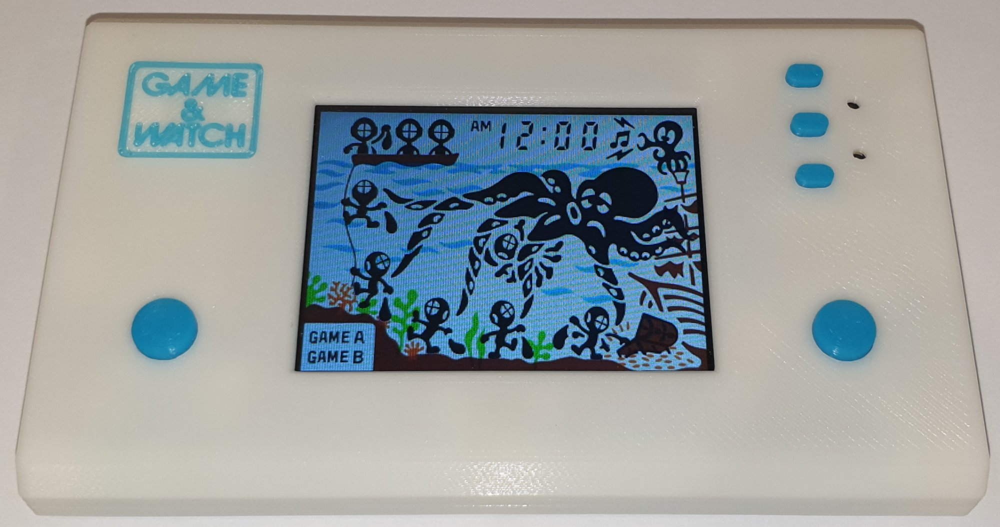

# Esp32-Game-and-Watch

## Single Screen

https://github.com/slowlane112/Esp32-Game-and-Watch/tree/main/gandw_single_screen

## Multi Screen

https://github.com/slowlane112/Esp32-Game-and-Watch/tree/main/gandw_multi_screen

## Single Screen Handheld

https://github.com/slowlane112/Esp32-Game-and-Watch/tree/main/gandw_single_screen_handheld

## Multi Screen Handheld

https://github.com/slowlane112/Esp32-Game-and-Watch/tree/main/gandw_multi_screen_handheld

## Multi Screen D-pad Handheld

https://github.com/slowlane112/Esp32-Game-and-Watch/tree/main/gandw_multi_screen_dpad_handheld

## Single Screen 4 Button Handheld

https://github.com/slowlane112/Esp32-Game-and-Watch/tree/main/gandw_single_screen_4button_handheld