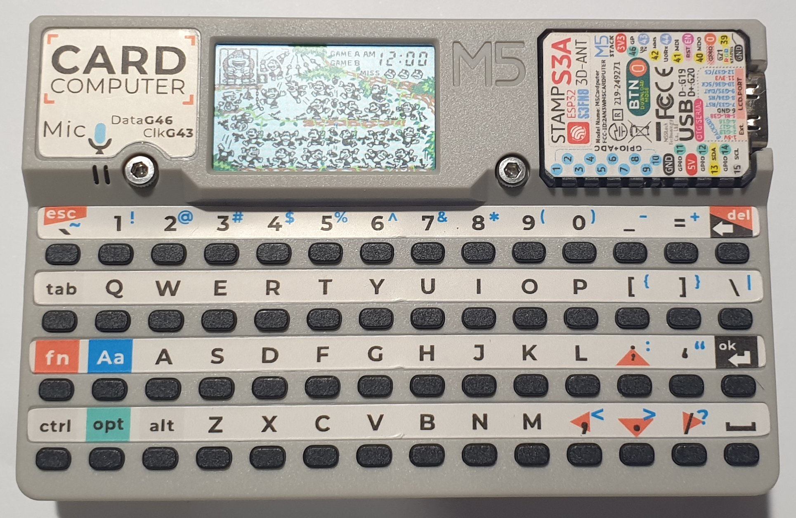
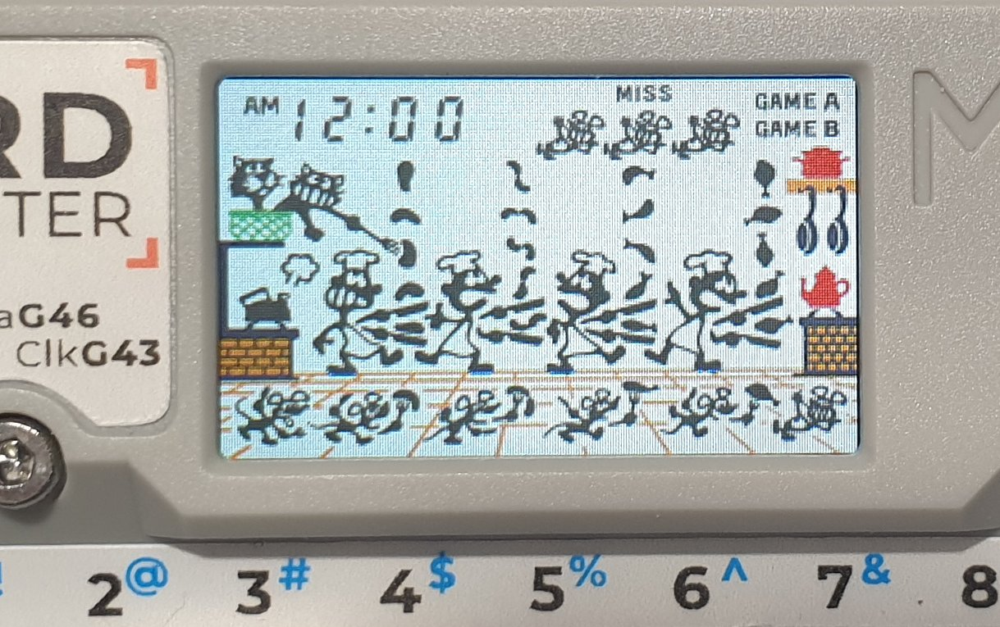

# Game and Watch for the CardPuter.

I developed it using the Cardputer v1.1. You might need to make some changes to get it to work on the other versions.

<table>
<tr>
    <td align="center"></td>
</tr>
<tr>
    <td align="center"></td>
</tr>
</table>

# Games

Supports 26 single screen Game and Watch games.<br>
Use the left and right arrow keys in the menu to select a game, then press Ok to start the game.<br>
You can return to the menu by pressing reset.


# Buttons

## Speaker Volume
<table>
<tr>
    <td>Up</td><td>;</td>
</tr>
<tr>
    <td>Down</td><td>.</td>
</tr>
</table>

## Main Buttons

<table>
<tr>
    <td>Game A</td><td>1</td>
</tr>
<tr>
    <td>Game B</td><td>2</td>
</tr>
<tr>
    <td>Time</td><td>3</td>
</tr>
<tr>
    <td>Alarm</td><td>4</td>
</tr>
<tr>
    <td>ACL</td><td>5</td>
</tr>
</table>

## 2 Button Games

<table>
<tr>
    <td>Left</td><td>ctrl</td>
</tr>
<tr>
    <td>Right</td><td>space</td>
</tr>
</table>

## 4 Button Games

<table>
<tr>
    <td>Left Up</td><td>fn</td>
</tr>
<tr>
    <td>Left Down</td><td>ctrl</td>
</tr>
<tr>
    <td>Right Up</td><td>enter</td>
</tr>
<tr>
    <td>Right Down</td><td>space</td>
</tr>
</table>

Mario's Cement Factory

<table>
<tr>
    <td>Left</td><td>ctrl</td>
</tr>
<tr>
    <td>Right</td><td>opt</td>
</tr>
<tr>
    <td>Open</td><td>space</td>
</tr>
</table>


## Directional Button Games

<table>
<tr>
    <td>Left</td><td>ctrl</td>
</tr>
<tr>
    <td>Right</td><td>alt</td>
</tr>
<tr>
    <td>Up</td><td>Aa</td>
</tr>
<tr>
    <td>Down</td><td>opt</td>
</tr>
<tr>
    <td>Button</td><td>space</td>
</tr>
</table>

# Roms
The roms must be in .gw format. 

These need to be created using LCD-Game-Shrinker from the MAME rom and artwork files.

You can download LCD-Game-Shrinker from here:

https://github.com/bzhxx/LCD-Game-Shrinker

You need to set the resoultion in LCD-Game-Shrinker to match the CardPuter's display.

In the file shrink_it.py change: 
```
gw_width=320
gw_height=240
```

to

```
gw_width=240
gw_height=135
```

Below is a list of the gw files required:

<table cellpadding="2" cellspacing="0">
<tr><td>Mame Rom</td><td>GW File</td></tr>
<tr><td>gnw_pchute</td><td>Game & Watch Parachute.gw</td></tr>
<tr><td>gnw_octopus</td><td>Game & Watch Octopus.gw</td></tr>
<tr><td>gnw_fire</td><td>Game & Watch Fire (Wide Screen).gw</td></tr>
<tr><td>gnw_chef</td><td>Game & Watch Chef.gw</td></tr>
<tr><td>gnw_popeye</td><td>Game & Watch Popeye (Wide Screen).gw</td></tr>
<tr><td>gnw_tbridge</td><td>Game & Watch Turtle Bridge.gw</td></tr>
<tr><td>gnw_vermin</td><td>Game & Watch Vermin.gw</td></tr>
<tr><td>gnw_ball</td><td>Game & Watch Ball.gw</td></tr>
<tr><td>gnw_fires</td><td>Game & Watch Fire (Silver).gw</td></tr>
<tr><td>gnw_helmet</td><td>Game & Watch Helmet (CN-17 version).gw</td></tr>
<tr><td>gnw_mariotj</td><td>Game & Watch Mario The Juggler.gw</td></tr>
<tr><td>gnw_tfish</td><td>Game & Watch Tropical Fish.gw</td></tr>
<tr><td>gnw_egg</td><td>Game & Watch Egg.gw</td></tr>
<tr><td>gnw_fireatk</td><td>Game & Watch Fire Attack.gw</td></tr>
<tr><td>gnw_flagman</td><td>Game & Watch Flagman.gw</td></tr>
<tr><td>gnw_judge</td><td>Game & Watch Judge (green version).gw</td></tr>
<tr><td>gnw_lion</td><td>Game & Watch Lion.gw</td></tr>
<tr><td>gnw_manhole</td><td>Game & Watch Manhole (New Wide Screen).gw</td></tr>
<tr><td>gnw_manholeg</td><td>Game & Watch Manhole (Gold).gw</td></tr>
<tr><td>gnw_mariocm</td><td>Game & Watch Mario's Cement Factory (New Wide Screen).gw</td></tr>
<tr><td>gnw_mmouse</td><td>Game & Watch Mickey Mouse (Wide Screen).gw</td></tr>
<tr><td>gnw_stennis</td><td>Game & Watch Snoopy Tennis.gw</td></tr>
<tr><td>gnw_dkjr</td><td>Game & Watch Donkey Kong Jr. (New Wide Screen).gw</td></tr>
<tr><td>gnw_bfightn</td><td>Game & Watch Balloon Fight (New Wide Screen).gw</td></tr>
<tr><td>gnw_climbern</td><td>Game & Watch Climber (New Wide Screen).gw</td></tr>
<tr><td>gnw_smbn</td><td>Game & Watch Super Mario Bros. (New Wide Screen).gw</td></tr>
</table>

Below is a link to a guide describing how to use LCD-Game-Shrinker to generate the files.

https://gist.github.com/DNA64/16fed499d6bd4664b78b4c0a9638e4ef

# Building
Install the ESP-IDF framework. The version I used was v5.4.1, but it should also work with newer versions.
https://docs.espressif.com/projects/esp-idf/en/stable/esp32s3/get-started/index.html

Make sure you can build the hello_world example project.

Download the code from this repo.

Use LCD-Game-Shrinker to generate a game files (see above) and place the gw files in the /gandw_cardputer/main/ directory.

Go back to /gandw_cardputer/ directory and open the terminal or cmd window in this directory.

## Linux
These instructions are for linux. If you are using windows follow the same steps you did when building the hello_world example project.

Run the export.sh script or get_idf if you set it up.

Export script should be similar to: 

```
. $HOME/esp/esp-idf/export.sh
```

Build: 
```
idf.py build
```

Then: 
```
idf.py -p /dev/ttyACM0 flash
```

You can also monitor by adding monitor at the end: 
```
idf.py -p /dev/ttyACM0 flash monitor 
```

Press Ctrl and ] to exit monitor.

If you are getting errors try a fullclean before building: 
```
idf.py fullclean
```


# Acknowledgements

## LCD-Game-Emulator
https://github.com/bzhxx/lcd-game-emulator

## Retro-Go
https://github.com/ducalex/retro-go

The LCD-Game-Emulator version used by the project was copied from Retro-Go because it contains additional code to handle the loading of the gw files.


