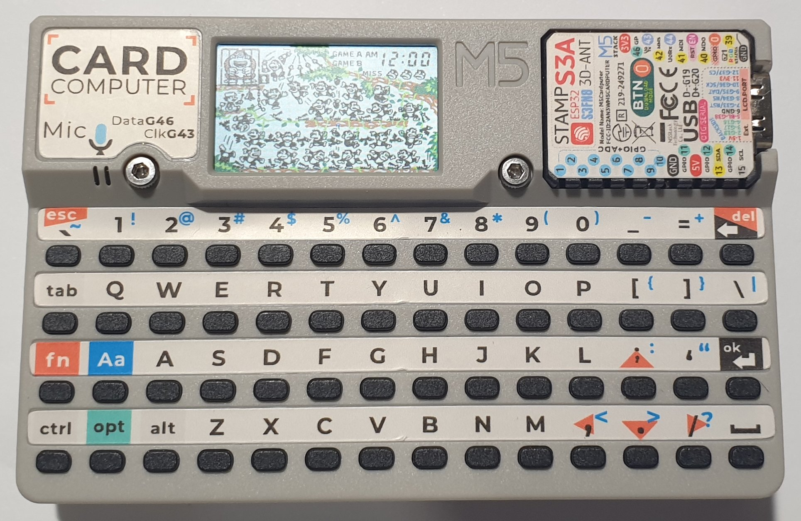
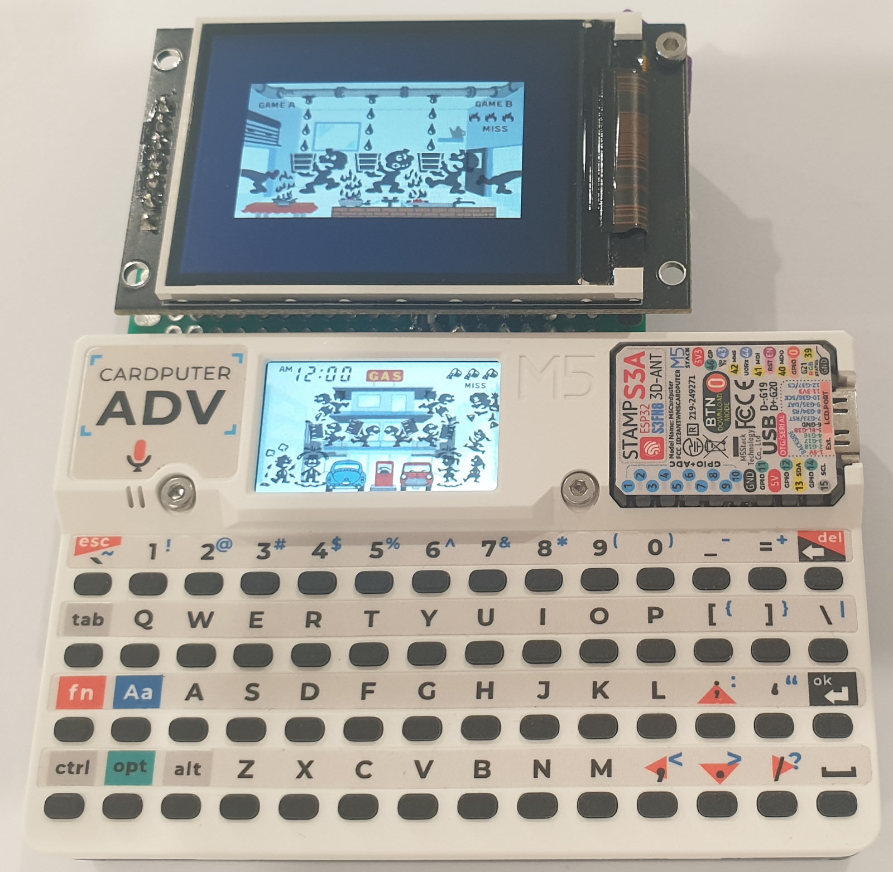

# Game and Watch for the Cardputer

There are 2 Game and Watch Cardputer models to build. The Multi Screen model only works with the Cardputer Adv. Select a model below for more information.

<table>
<tr>
<td><strong>Cardputer</strong></td>
</tr>
<tr>
<td>
	
<strong>Single Screen - Cardputer v1.1 and Cardputer Adv.</strong>

	

	
<a href="https://github.com/slowlane112/Esp32-Game-and-Watch/tree/main/gandw_cardputer/README-cardputer.md">https://github.com/slowlane112/Esp32-Game-and-Watch/tree/main/gandw_cardputer/README-cardputer.md</a>

</td>
</tr>
<tr>
<td>
	
<strong>Multi Screen - Cardputer Adv.</strong>

	

	
<a href="https://github.com/slowlane112/Esp32-Game-and-Watch/tree/main/gandw_cardputer/README-cardputer_multi_screen.md">https://github.com/slowlane112/Esp32-Game-and-Watch/tree/main/gandw_cardputer/README-cardputer_multi_screen.md</a>

</td>
</tr>
</table>
