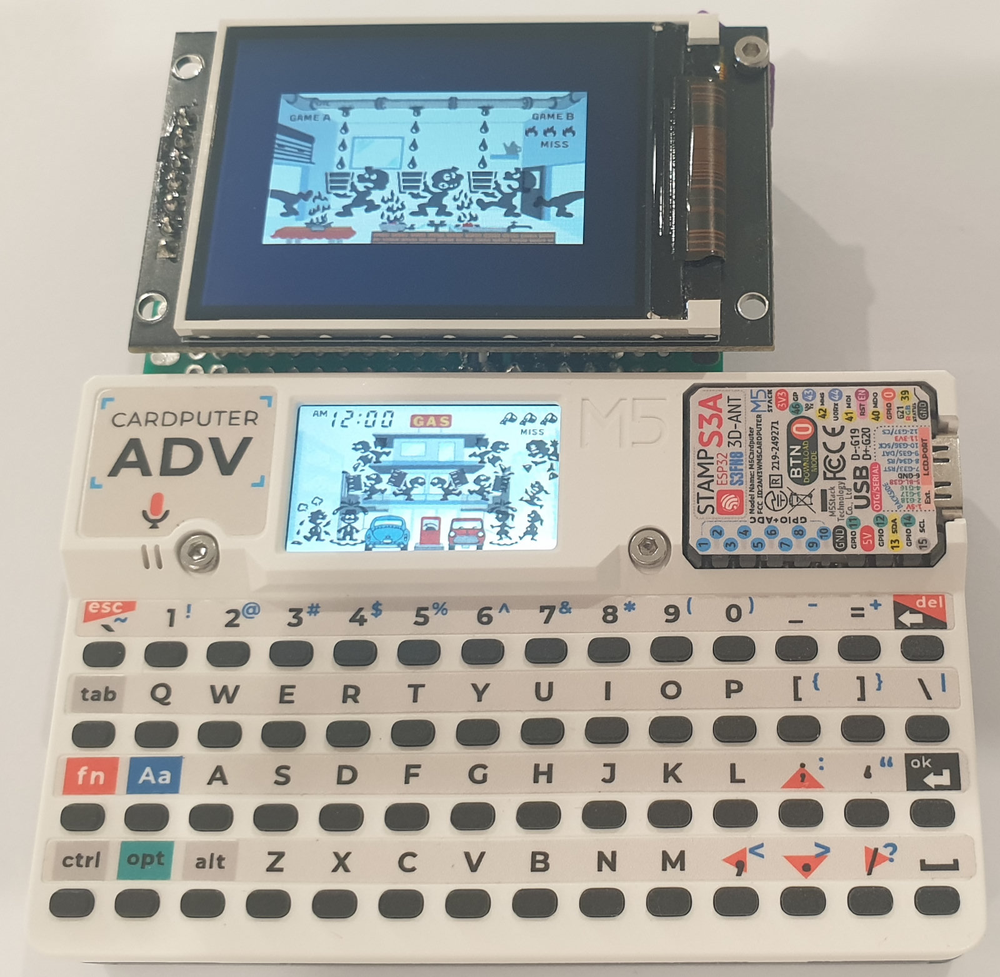
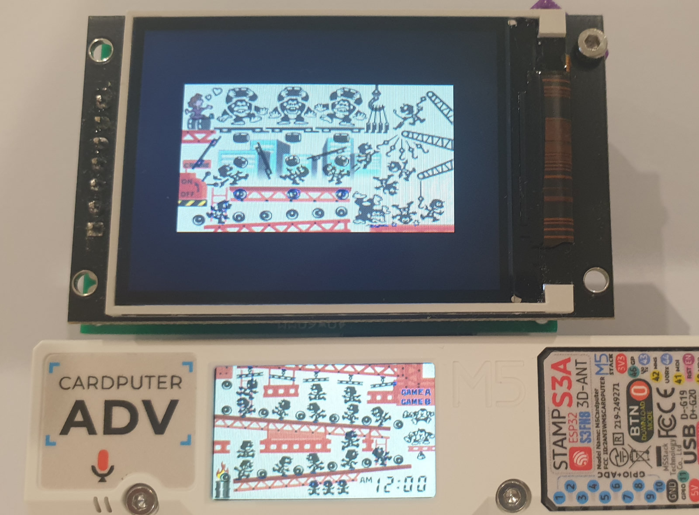
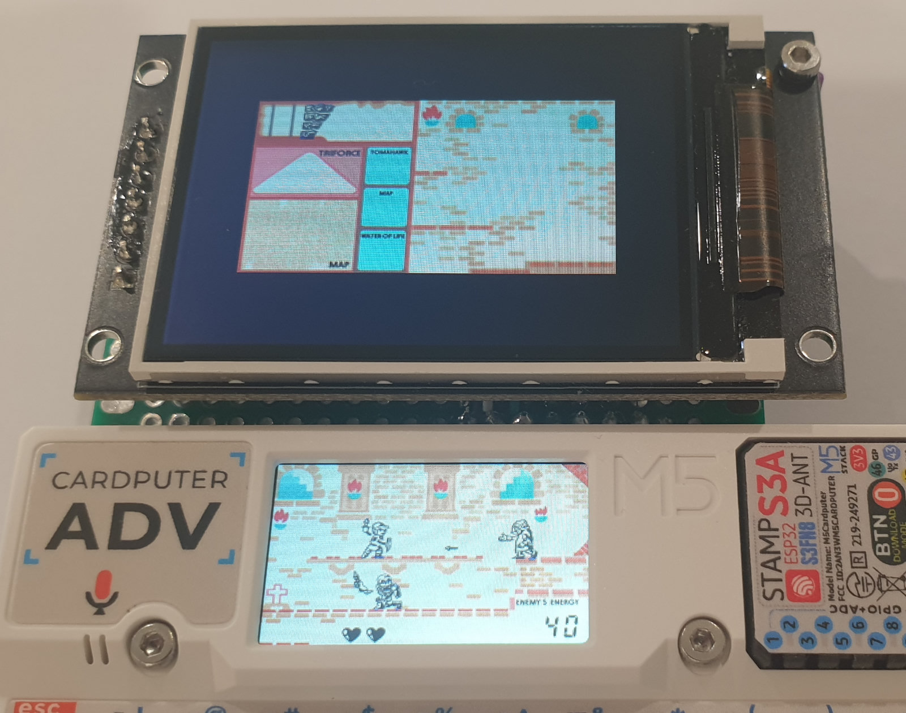
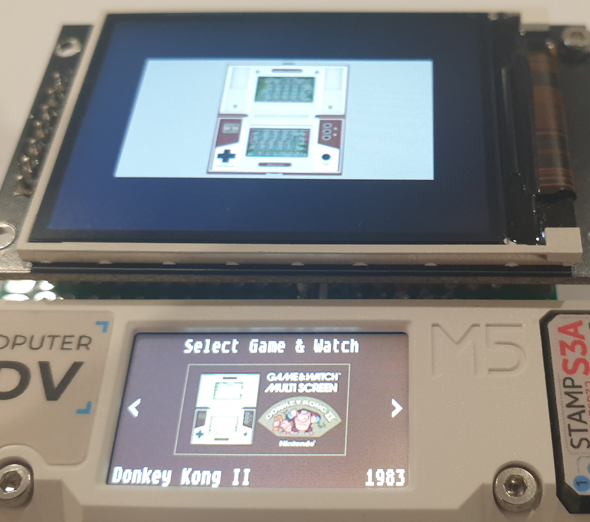
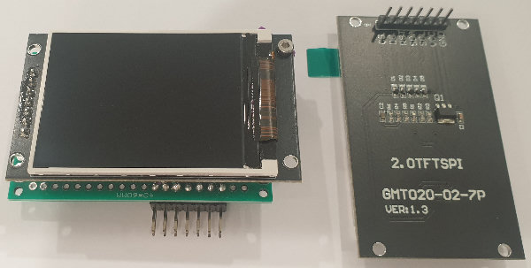

# Game and Watch Multi Screen for the CardPuter.

Play Multi Screen Game and Watch games using an external display on the cardputer.<br>

The Cardputer does not have any PSRAM and only has just enough memory to display Game and Watch multi‑screen games on two 240x135 displays.<br>

Due to the memory constraints, the Cardputer cannot process a compressed multi screen *.gw rom file, so you must use the uncompressed *.gw files. More info below.<br>

Tested with the Cardputer Adv.

<table>
<tr>
    <td align="center"></td>
</tr>
<tr>
    <td align="center"></td>
</tr>
<tr>
    <td align="center"></td>
</tr>
<tr>
    <td align="center"></td>
</tr>
</table>

# Games

Supports 12 multi screen Game and Watch games.<br>
Use the left and right arrow keys in the menu to select a game, then press Ok to start the game.<br>
You can return to the menu by pressing and holding the backspace key or pressing the cardputers reset button.


# Display

I used a 2 inch ST7789V 320x240 SPI Interface Display Module.



## Wiring
- VCC:        5v out
- GND:        GND
- CS:         GPIO 5
- DC:         GPIO 15
- RST:        GPIO 13
- SDA/MOSI:   GPIO 14
- SCK/SCL:    GPIO 39

It should be ok to use any ST7789V panel that is at least 240x135.

If your panel is not 320x240 update /gandw_cardputer_multi_screen/main/lcd_game_emulator/src/gw_sys/gw_system.h with the details.

```
#define DISPLAY2_WIDTH 320
#define DISPLAY2_HEIGHT 240
```

You can adjust the position of the rendered content in /gandw_cardputer_multi_screen/main/gandw.c

```
// position top display here
esp_lcd_panel_set_gap(spi_lcd_2_handle, 40, 53);
```

# Buttons

## Speaker Volume
<table>
<tr>
    <td>Up</td><td>;</td>
</tr>
<tr>
    <td>Down</td><td>.</td>
</tr>
</table>

## Main Buttons

<table>
<tr>
    <td>Game A</td><td>1</td>
</tr>
<tr>
    <td>Game B</td><td>2</td>
</tr>
<tr>
    <td>Time</td><td>3</td>
</tr>
<tr>
    <td>Alarm</td><td>4</td>
</tr>
<tr>
    <td>ACL</td><td>5</td>
</tr>
</table>

## 2 Button Games

<table>
<tr>
    <td>Left</td><td>ctrl</td>
</tr>
<tr>
    <td>Right</td><td>space</td>
</tr>
</table>

## Directional Button Games

<table>
<tr>
    <td>Left</td><td>ctrl</td>
</tr>
<tr>
    <td>Right</td><td>alt</td>
</tr>
<tr>
    <td>Up</td><td>Aa</td>
</tr>
<tr>
    <td>Down</td><td>opt</td>
</tr>
<tr>
    <td>Button</td><td>space</td>
</tr>
</table>


## 4 Button Games

Mickey & Donald, Squish

<table>
<tr>
    <td>Up</td><td>fn</td>
</tr>
<tr>
    <td>Down</td><td>ctrl</td>
</tr>
<tr>
    <td>Left</td><td>/</td>
</tr>
<tr>
    <td>Right</td><td>space</td>
</tr>
</table>

Black Jack

<table>
<tr>
    <td>Double Down</td><td>fn</td>
</tr>
<tr>
    <td>Bet x10 / Hit</td><td>ctrl</td>
</tr>
<tr>
    <td>Enter</td><td>enter</td>
</tr>
<tr>
    <td>Bet x1 / Stand</td><td>space</td>
</tr>
</table>

# Roms
The roms must be in uncompressed .gw format. 

These need to be created using LCD-Game-Shrinker from the MAME rom and artwork files.

```diff
- MUST USE uncompressed *.gw files:
- Due to memory constraints, the Cardputer cannot decompress a compressed multi screen *.gw rom file, 
- so you must use the uncompressed *.gw files. 
- These can be found in the each games folder in LCD‑Game‑Shrinker build directory.
- Do not use the compressed *.gw files from the output directory.
```

You can download LCD-Game-Shrinker from here:

https://github.com/bzhxx/LCD-Game-Shrinker

You need to set the resoultion in LCD-Game-Shrinker to 240x270.

In the file shrink_it.py change: 
```
gw_width=320
gw_height=240
```

to

```
gw_width=240
gw_height=270
```

Below is a list of the uncompressed gw files required:

<table cellpadding="2" cellspacing="0">
<tr><td>Mame Rom</td><td>GW File</td></tr>
<tr><td>gnw_bjack</td><td>gnw_bjack.gw</td></tr>
<tr><td>gnw_bsweep</td><td>gnw_bsweep.gw</td></tr>
<tr><td>gnw_dkong2</td><td>gnw_dkong2.gw</td></tr>
<tr><td>gnw_dkong</td><td>gnw_dkong.gw</td></tr>
<tr><td>gnw_gcliff</td><td>gnw_gcliff.gw</td></tr>
<tr><td>gnw_ghouse</td><td>gnw_ghouse.gw</td></tr>
<tr><td>gnw_mickdon</td><td>gnw_mickdon.gw</td></tr>
<tr><td>gnw_opanic</td><td>gnw_opanic.gw</td></tr>
<tr><td>gnw_pinball</td><td>gnw_pinball.gw</td></tr>
<tr><td>gnw_sbuster</td><td>gnw_sbuster.gw</td></tr>
<tr><td>gnw_squish</td><td>gnw_squish.gw</td></tr>
<tr><td>gnw_zelda</td><td>gnw_zelda.gw</td></tr>
</table>

Below is a link to a guide describing how to use LCD-Game-Shrinker to generate the files.

https://gist.github.com/DNA64/16fed499d6bd4664b78b4c0a9638e4ef


## Additional Steps for Multi Screen Games

LCD Game Shrinker will convert multi screen games into one screen games in portrait mode, so we need to do some additional steps when generating the gw files.

Below are instructions to fix oil panic. All other multi screen games will be similar.

Make a copy of LCD-Game-Shrinker to use for multi screen games.

In the file shrink_it.py set: 
```
gw_width=240
gw_height=270
```
In the custom directory, edit gnw_opanic.py

set rom.rotate to false
```
rom.rotate = False
```
Change rom.width_border_ratio from:
```
rom.width_border_ratio = 10/100
```
to:
```
rom.width_border_ratio = 0
```

## Black border between screens
If you run LCD Game Shrinker now there will be a black bar of about 10 pixels between the top and bottom screen.
The gw file will still work ok, but it is a good idea to remove it as it is wasting 10 pixels from the display.

To remove the black bar you need to:

- Extract the artwork zip file.
- Edit the default.lay file to remove the black bar.
- Zip the files again with the updated default.lay file.

In the default.lay file, find the view with the Backgrounds Only. (They usually have a height of 1669).

There is usually more than 1 background view. I am not sure which view LCD Game Shrinker uses so i was just updating all of them. They all use that same values so it is quick to update all of them at the same time.


```
<view name="Backgrounds Only">

<bounds x="32" y="33" width="1296" height="1669" />
	
	<element ref="Screen-Top">					<bounds x="32" y="33" width="1296" height="817" /></element>
	<screen index="0" blend="multiply">			<bounds x="1" y="9" width="1349" height="899" /></screen>
	<element ref="Screen-Top">					<bounds x="32" y="33" width="1296" height="817" /><color alpha="0.0" /></element>
	
	<element ref="Screen-Bottom">				<bounds x="32" y="885" width="1296" height="817" /></element>
	<screen index="1" blend="multiply">			<bounds x="-1" y="903" width="1371" height="878" /></screen>
	<element ref="Screen-Bottom">				<bounds x="32" y="885" width="1296" height="817" /><color alpha="0.00" /></element>
	<element ref="Balcony">				<bounds x="32" y="885" width="1296" height="817" /><color alpha="0.5" /></element>

</view>
```

New height: (Screen-Top + Screen-Bottom) 817 + 817 = 1634

Height difference: 1669 - 1634 = 35

Bounds height attribute is updated with the new height.

The height difference is removed from the y attribute of all the bottom screen elements.


```
<view name="Backgrounds Only">

<bounds x="32" y="33" width="1296" height="1634" />
	
	<element ref="Screen-Top">					<bounds x="32" y="33" width="1296" height="817" /></element>
	<screen index="0" blend="multiply">			<bounds x="1" y="9" width="1349" height="899" /></screen>
	<element ref="Screen-Top">					<bounds x="32" y="33" width="1296" height="817" /><color alpha="0.0" /></element>
	
	<element ref="Screen-Bottom">				<bounds x="32" y="850" width="1296" height="817" /></element>
	<screen index="1" blend="multiply">			<bounds x="-1" y="868" width="1371" height="878" /></screen>
	<element ref="Screen-Bottom">				<bounds x="32" y="850" width="1296" height="817" /><color alpha="0.00" /></element>
	<element ref="Balcony">				<bounds x="32" y="850" width="1296" height="817" /><color alpha="0.5" /></element>

</view>
```


# Building
Install the ESP-IDF framework. The version I used was v5.4.1, but it should also work with newer versions.
https://docs.espressif.com/projects/esp-idf/en/stable/esp32s3/get-started/index.html

Make sure you can build the hello_world example project.

Download the code from this repo.

Use LCD-Game-Shrinker to generate the game files (see above) and place the **uncompressed** gw files in the /gandw_cardputer_multi_screen/main/ directory.

Go back to /gandw_cardputer_multi_screen/ directory and open the terminal or cmd window in this directory.

## Linux
These instructions are for linux. If you are using windows follow the same steps you did when building the hello_world example project.

Run the export.sh script or get_idf if you set it up.

Export script should be similar to: 

```
. $HOME/esp/esp-idf/export.sh
```

Build: 
```
idf.py build
```

Then: 
```
idf.py -p /dev/ttyACM0 flash
```

You can also monitor by adding monitor at the end: 
```
idf.py -p /dev/ttyACM0 flash monitor 
```

Press Ctrl and ] to exit monitor.

If you are getting errors try a fullclean before building: 
```
idf.py fullclean
```


# Acknowledgements

## LCD-Game-Emulator
https://github.com/bzhxx/lcd-game-emulator

## Retro-Go
https://github.com/ducalex/retro-go

The LCD-Game-Emulator version used by the project was copied from Retro-Go because it contains additional code to handle the loading of the gw files.


