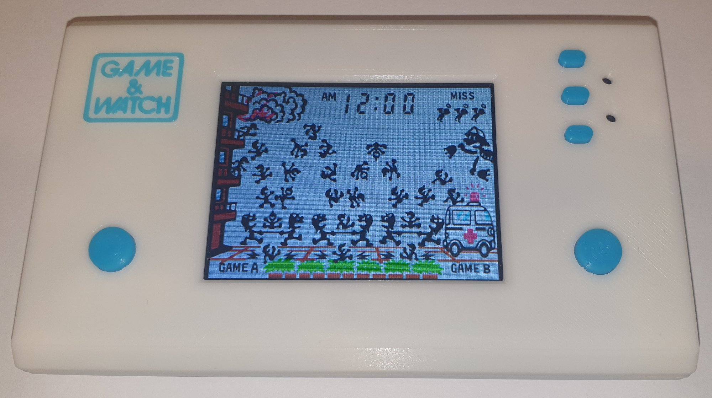
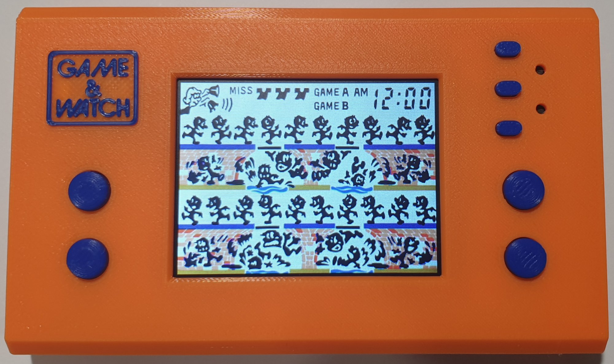
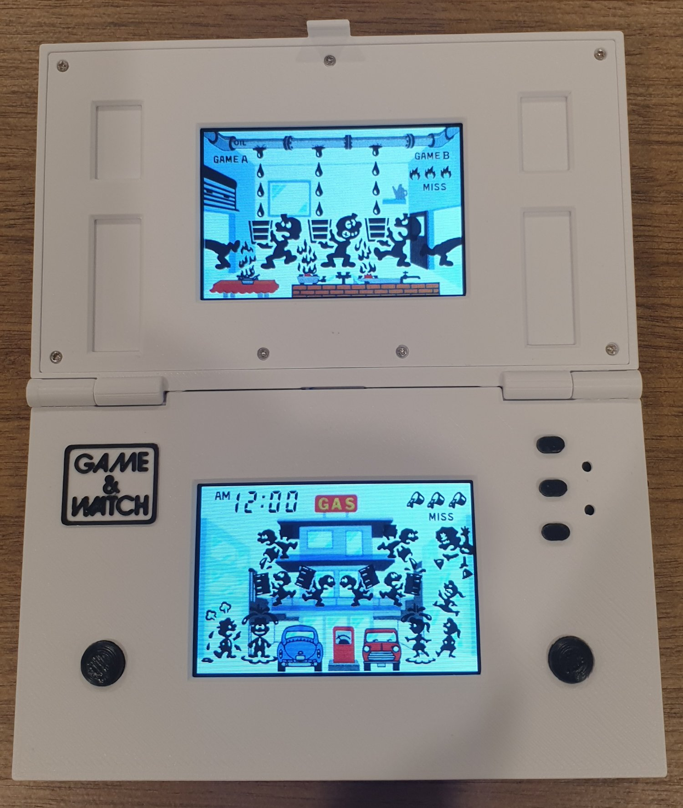
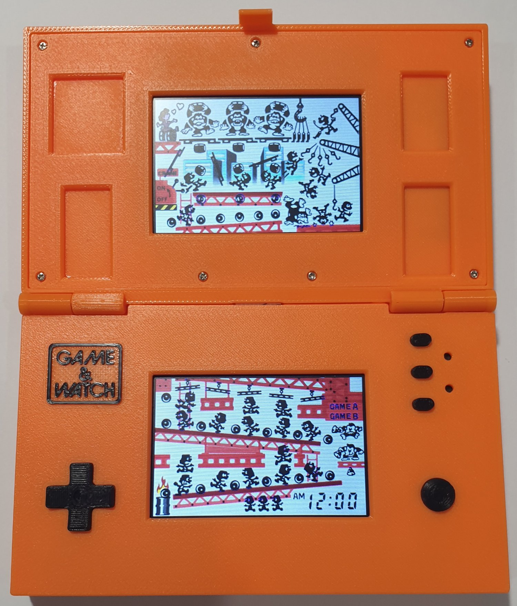

# Game and Watch Handhelds

There are 4 Game and Watch models to build. Select a model below for more information.

<table>
<tr>
<td><strong>Single Screen Handhelds</strong></td>
</tr>
<tr>
<td>
	
<strong>2 Buttons</strong>

	

	
<a href="https://github.com/slowlane112/Esp32-Game-and-Watch/tree/main/gandw_handheld/README-single_screen_2_button.md">https://github.com/slowlane112/Esp32-Game-and-Watch/tree/main/gandw_handheld/README-single_screen_2_button.md</a>

</td>
</tr>
<tr>
<td>
	
<strong>4 Buttons</strong>

	

	
<a href="https://github.com/slowlane112/Esp32-Game-and-Watch/tree/main/gandw_handheld/README-single_screen_4_button.md">https://github.com/slowlane112/Esp32-Game-and-Watch/tree/main/gandw_handheld/README-single_screen_4_button.md</a>

</td>	
</tr>
</table>

 

<table>
<tr>
<td><strong>Multi Screen Handhelds</strong></td>
</tr>
<tr>
<td>
	
<strong>2 Buttons</strong>

	

	
<a href="https://github.com/slowlane112/Esp32-Game-and-Watch/tree/main/gandw_handheld/README-multi_screen_2_button.md">https://github.com/slowlane112/Esp32-Game-and-Watch/tree/main/gandw_handheld/README-multi_screen_2_button.md</a>

</td>
</tr>
<tr>
<td>
	
<strong>D-pad</strong>

	

	
<a href="https://github.com/slowlane112/Esp32-Game-and-Watch/tree/main/gandw_handheld/README-multi_screen_dpad.md">https://github.com/slowlane112/Esp32-Game-and-Watch/tree/main/gandw_handheld/README-multi_screen_dpad.md</a>

</td>	
</tr>
</table>
