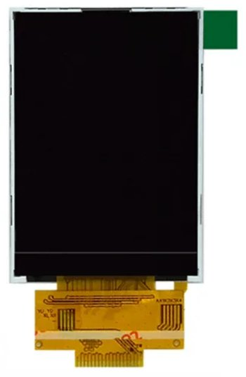

# Description
A demo program using minimal code to run a multi screen game and watch rom on an esp32s3 via LCD Game Emulator.


# Components
- ESP32-S3-Zero
- Lcd: 240x320 2.4 inch SPI panel with ILI9341 driver
- Audio: Max98357 I2S Amp
- Speaker
- Mini push Buttons




# Wiring

## LCD 1
- VCC:        ESP32 3.3v
- GND:        GND
- CS:         GND
- RESET:      GPIO 13
- DC:         GPIO 9
- MOSI        GPIO 11
- SCK:        GPIO 12
- LED:        ESP32 3.3v

## LCD 2
- VCC:        ESP32 3.3v
- GND:        GND
- CS:         GND
- RESET:      GPIO 39
- DC:         GPIO 38
- MOSI        GPIO 17
- SCK:        GPIO 18
- LED:        ESP32 3.3v

## Max98357
- VIN:        ESP32 3.3v
- GND:        GND
- LRC (WS):   GPIO 4    
- BCLK:       GPIO 10
- DIN:        GPIO 6

## Buttons
- GAME A       GPIO 14
- GAME B       GPIO 5
- TIME         GPIO 3
- LEFT         GPIO 2
- RIGHT        GPIO 1
- ALARM        GPIO 7
- ACL          GPIO 8

# Screen Resolution
The ESP32-S3-Zero does not have enough memory to display 2 screens at 320 x 240 resolution.

It does have enough memory to display 2 screens at 320 x 210 resolution.

This is closer to the aspect ratio of the original multi screen game and watch games and what i have used in this project.

This makes the total resolution 320 x 420.


# Roms
The roms must be in .gw format.

These can be created using LCD-Game-Shrinker.

https://github.com/bzhxx/LCD-Game-Shrinker

Below is a link to a guide describing how to use LCD-Game-Shrinker to generate the files.

https://gist.github.com/DNA64/16fed499d6bd4664b78b4c0a9638e4ef

## Additional Steps for Multi Screen Games

LCD Game Shrinker will convert multi screen games into one screen games in portrait mode, so we need to do some additional steps when generating the gw files.

Below are instructions to fix oil panic. All other multi screen games will be similar.

Make a copy of LCD-Game-Shrinker to use for multi screen games.

In the file shrink_it.py set: 
```
gw_height=420
```
In the custom directory, edit gnw_opanic.py

set rom.rotate to false
```
rom.rotate = False
```
Change rom.width_border_ratio from:
```
rom.width_border_ratio = 10/100
```
to:
```
rom.width_border_ratio = 0
```

## Black border between screens
If you run LCD Game Shrinker now there will be a black bar of about 10 pixels between the top and bottom screen.
The gw file will still work ok, but it is a good idea to remove it as it is wasting 10 pixels from the display.

To remove the black bar you need to:

- Extract the artwork zip file.
- Edit the default.lay file to remove the black bar.
- Zip the files again with the updated default.lay file.

In the default.lay file, find the view with the Backgrounds Only. (They usually have a height of 1669).

There is usually more than 1 background view. I am not sure which view LCD Game Shrinker uses so i was just updating all of them. They all use that same values so it is quick to update all of them at the same time.


```
<view name="Backgrounds Only">

<bounds x="32" y="33" width="1296" height="1669" />
	
	<element ref="Screen-Top">					<bounds x="32" y="33" width="1296" height="817" /></element>
	<screen index="0" blend="multiply">			<bounds x="1" y="9" width="1349" height="899" /></screen>
	<element ref="Screen-Top">					<bounds x="32" y="33" width="1296" height="817" /><color alpha="0.0" /></element>
	
	<element ref="Screen-Bottom">				<bounds x="32" y="885" width="1296" height="817" /></element>
	<screen index="1" blend="multiply">			<bounds x="-1" y="903" width="1371" height="878" /></screen>
	<element ref="Screen-Bottom">				<bounds x="32" y="885" width="1296" height="817" /><color alpha="0.00" /></element>
	<element ref="Balcony">				<bounds x="32" y="885" width="1296" height="817" /><color alpha="0.5" /></element>

</view>
```

New height: (Screen-Top + Screen-Bottom) 817 + 817 = 1634

Height difference: 1669 - 1634 = 35

Bounds height attribute is updated with the new height.

The height difference is removed from the y attribute of all the bottom screen elements.


```
<view name="Backgrounds Only">

<bounds x="32" y="33" width="1296" height="1634" />
	
	<element ref="Screen-Top">					<bounds x="32" y="33" width="1296" height="817" /></element>
	<screen index="0" blend="multiply">			<bounds x="1" y="9" width="1349" height="899" /></screen>
	<element ref="Screen-Top">					<bounds x="32" y="33" width="1296" height="817" /><color alpha="0.0" /></element>
	
	<element ref="Screen-Bottom">				<bounds x="32" y="850" width="1296" height="817" /></element>
	<screen index="1" blend="multiply">			<bounds x="-1" y="868" width="1371" height="878" /></screen>
	<element ref="Screen-Bottom">				<bounds x="32" y="850" width="1296" height="817" /><color alpha="0.00" /></element>
	<element ref="Balcony">				<bounds x="32" y="850" width="1296" height="817" /><color alpha="0.5" /></element>

</view>
```


# Building
Install the ESP-IDF framework. Current version is v5.4.1
https://docs.espressif.com/projects/esp-idf/en/stable/esp32s3/get-started/index.html

Make sure you can build the hello_world example project.

Download the code from this repo.

Use LCD-Game-Shrinker to generate a rom file for oil panic. Rename the file to gnwoilpanic.gw, and place the file in the /gandw_multi_screen/main/ directory.

Go back to /gandw_multi_screen/ directory and open the terminal or cmd window in this directory.

## Linux
These instructions are for linux. If you are using windows follow the same steps you did when building the hello_world example project.

Run the export.sh script or get_idf if you set it up.

Export script should be similar to: 

```
. $HOME/esp/esp-idf/export.sh
```

Build: 
```
idf.py build
```

Then: 
```
idf.py -p /dev/ttyACM0 flash
```

You can also monitor by adding monitor at the end: 
```
idf.py -p /dev/ttyACM0 flash monitor 
```

Press Ctrl and ] to exit monitor.

If you are getting errors try a fullclean before building: 
```
idf.py fullclean
```

# Esp32
The code has been setup to run on a ESP32-S3-Zero dev board.

If you are using another ESP32-S3 you will need to setup PSRAM for your device and maybe alter the GPIO's used.

For the ESP32-S3-WROOM1 dev board you can setup PSRAM using 
```
idf.py menuconfig
```
Go to Component config → ESP PSRAM → Support for external, SPI-connected RAM → SPI RAM config
 and enable Octal Mode PSRAM.


# LCD Display

## Orientation

In the setup_lcd_spi function, there are 2 commands that you can use to change the screen orientation.

- esp_lcd_panel_swap_xy
- esp_lcd_panel_mirror

## Pixel Data

All the ILI9341 lcd panels i used required the pixel data to be byte swapped for the image to be displayed correctly.

I have swapped the byte order for the background and segment pixel data in lcd game emulator.

If the image displayed on your screen looks incorrect (wrong colours) you can remove the byte swap code.

In the file: /main/lcd_game_emulator/src/gw_sys/gw_romloader.c, comment or remove the byte swap for loop.

```
    gw_background = (unsigned short *)&GW_ROM[gw_head.background_pixel];

    // Byte swap background
    /* for (int i = 0; i < GW_SCREEN_HEIGHT * GW_SCREEN_WIDTH; i++) {
        gw_background[i] = (gw_background[i] >> 8) | (gw_background[i] << 8);
    } */
```
In the file: /main/lcd_game_emulator/src/gw_sys/gw_graphic.c:

Look for the rgb_multiply_8bits function.

Comment the byte swap version and uncomment the non byte swap version.

# Audio

The volume level can be altered by a changing the value of the sample variable.

```
if (gw_audio_buffer[i] > 0) {
    sample = 2000;
}
```

# Acknowledgements

## LCD-Game-Emulator
https://github.com/bzhxx/lcd-game-emulator

## Retro-Go
https://github.com/ducalex/retro-go

The LCD-Game-Emulator version used by the project was copied from Retro-Go because it contains additional code to handle the loading of the gw files.


