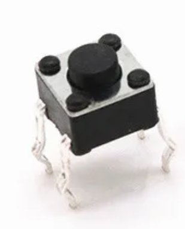

# Multi Screen Handheld


# Disclaimer: 

This project is a work in progress.

I assume no responsibility or liability for any errors, omissions, or outcomes resulting from the use of the information provided within this project.

You are strongly advised to conduct your own thorough research and ensure you have a comprehensive understanding of best practices for the safe charging and handling of Li-ion batteries. Improper handling can lead to serious risks, including but not limited to fire, explosion, or personal injury.

Use the information provided in this project at your own risk.

<table>
<tr>
    <td></td>
    <td></td>
</tr>
<tr><td colspan="2"></td></tr>
<tr>
    <td></td>
    <td></td>
</tr>
</table>


# Features

Plays 3 two button multi screen game and watch games. Press button on power up to select the game.
Game A: Oil Panic
Game B: Safebuster
Time: Pinball
Remembers last game selected if no buttons pressed on power up.

## Volume Adjustment
Volume adjustment with on screen display.
Volume down: Time and Left buttons.
Volume up: Time and Right buttons.
Remembers volume level on power up.

## Power
Two 10440 batteries, USB-C charging and on/off switch.

## Battery Level Indicator
Battery level is displayed on power up.

# Components
- ESP32-S3-Zero
- Display: 2 x 2.4 inch SPI panel 240x320 LCD with ILI9341 driver
  (No board - LCD only, No Touch. AliExpress seller: XunMing Store)
- Audio: Max98357 I2S Amp
- Speaker: 20mm
- USB-C TP4056 Battery Charger Module 
- 2 x 10440 Li-ion batteries
- Mini Push Buttons 4.5mm x 4.5mm x 3.8mm
- 3mm SS12d00 mini slide switch.
- AO3401A mosfet
- 1N5817 schottky diode
- 10cm FFC Flexible Flat Ribbon Cable - 1.0mm Pitch 10 Pin.
- FFC FPC connector adapter board. 10P - 1mm pitch.
- Resistors: 2 x 4.7K, 10K and 100K
- Screws M2 - 4mm, 6mm and 8mm long.
- Screws to mount the TP4056 module. 2 x M1.5
- Screws to mount the top display. 7 x M1.5 3mm long.
- Hinge screws: M2 x 20mm long

<table>
<tr>
    <td></td>
    <td></td>
    <td></td>    
    <td></td>
    <td></td>
</tr>
</table>

<table>
<tr>
    <td></td>
    <td></td>
    <td></td>
    <td></td>
    <td></td>
</tr>
</table>

# Top Screen

<table>
<tr>
    <td></td>
    <td></td>
    <td></td>
</tr>
</table>

Connect the display to a 10 pin ribbon cable using small wires.

In the bottom screen section, trim size of ribbon cable connector adapter board so it will fit in space near the speaker.

# Power


## TP4056

A TP4056 module is used to charge the battery. These modules are designed for charging 18650 batteries at 1A.

To charge 10440 batteries, resistor R3 should be replaced with a 4.7kΩ resistor. This will charge the battery at approximately 250mA. To make it easier, after removing resistor R3, you can connect a wire to pin 2 of the main IC and mount the 4.7kΩ resistor on a perfboard with the other end connected to ground.

A mosfet (AO3401A) is used to disconnect the load from the battery while it is charging. This can be skipped if you remember to always turn off the device when it is charging. If you plan on using the mosfet, to make it easier you can connect a wire to pin 4 of the main IC and connect the other end to the schottky diode leading to the mosfet gate.

The TP4056 can only be mounted via the holes in the USB voltage pads. When you insert a screw into the pads it might break the connection between the top and bottom pads. If you plan to use these pads check to make sure the connection is not broken after you screw them in place.


## Battery Level Indicator

The battery voltage is sent to GPIO 16 for a battery level indicator. The ESP32-S3 ADC can measure voltages up to 3.1V so a voltage divider is used to drop the voltage to a suitable level.

With a few changes, the AO3401A mosfet can be setup to power the load from USB power while the battery is changing, however if you choose to do this you will also need to alter the voltage divider values to make sure the voltage at GPIO 16 does not exceed 3.1V.

## Jumper

A jumper has been placed between the ESP32 5v pin and the switch. This jumper should be open when connecting the ESP32 to USB for debugging. Failure to open the jumper will result in voltage from ESP32 making its way to the batteries if the switch is also turned on. You could skip the jumper installation, and always make sure the switch is off when debugging, but you will need the jumper installed and open if you want to debug the battery level indicator code.

## 3D Files

View 3D files: [Multi Screen Handheld 3D Files](../assets/3d_files/gandw_mulit_screen_handheld/)

For a cleaner print and to save on supports "top case front" and "bottom case front" can be printed in parts.

If printing in parts to ensure proper alignment, glue the hinges in place while they are attached to the top case.


## Button Circuit Boards

The buttons need to be mounted on 2.54mm pitch perfboard. 

The alarm and ACL buttons need to be mounted slightly high on the board. Use the spacer (alarm_acl_button_spacer.stl) to mount them at the correct height.

The diagrams below show how to mount the buttons:

<table>
<tr>
    <td></td>
    <td></td>
</tr>
</table>


# Wiring

## LCD 1 ILI9341
- VCC:        ESP32 3.3v
- GND:        GND
- CS:         GND
- RESET:      GPIO 13
- DC:         GPIO 9
- MOSI        GPIO 11
- SCK:        GPIO 12
- LEDA:       ESP32 3.3v
- LEDK1:      GND  

## LCD 2 ILI9341
- VCC:        ESP32 3.3v
- GND:        GND
- CS:         GND
- RESET:      GPIO 39
- DC:         GPIO 38
- MOSI        GPIO 17
- SCK:        GPIO 18
- LEDA:       ESP32 3.3v
- LEDK1:      GND

## Max98357
- VIN:        ESP32 3.3v
- GND:        GND
- LRC (WS):   GPIO 4    
- BCLK:       GPIO 10
- DIN:        GPIO 6

## Buttons
- GAME A:       GPIO 14
- GAME B:       GPIO 5
- TIME:         GPIO 3
- LEFT:         GPIO 2
- RIGHT:        GPIO 1
- ALARM:        GPIO 7
- ACL:          GPIO 8

## Battery Level
- Battery +:   GPIO 16 (via voltage divider)

# Screen Resolution
The ESP32-S3-Zero does not have enough memory to display 2 screens at 320 x 240 resolution.

It does have enough memory to display 2 screens at 320 x 210 resolution.

This is closer to the aspect ratio of the original multi screen game and watch games and what i have used in this project.

This makes the total resolution 320 x 420.


# Roms
The roms must be in .gw format.

These can be created using LCD-Game-Shrinker.

https://github.com/bzhxx/LCD-Game-Shrinker

Below is a link to a guide describing how to use LCD-Game-Shrinker to generate the files.

https://gist.github.com/DNA64/16fed499d6bd4664b78b4c0a9638e4ef

## Additional Steps for Multi Screen Games

LCD Game Shrinker will convert multi screen games into one screen games in portrait mode, so we need to do some additional steps when generating the gw files.

Below are instructions to fix oil panic. All other multi screen games will be similar.

Make a copy of LCD-Game-Shrinker to use for multi screen games.

In the file shrink_it.py set: 
```
gw_height=420
```
In the custom directory, edit gnw_opanic.py

set rom.rotate to false
```
rom.rotate = False
```
Change rom.width_border_ratio from:
```
rom.width_border_ratio = 10/100
```
to:
```
rom.width_border_ratio = 0
```

## Black border between screens
If you run LCD Game Shrinker now there will be a black bar of about 10 pixels between the top and bottom screen.
The gw file will still work ok, but it is a good idea to remove it as it is wasting 10 pixels from the display.

To remove the black bar you need to:

- Extract the artwork zip file.
- Edit the default.lay file to remove the black bar.
- Zip the files again with the updated default.lay file.

In the default.lay file, find the view with the Backgrounds Only. (They usually have a height of 1669).

There is usually more than 1 background view. I am not sure which view LCD Game Shrinker uses so i was just updating all of them. They all use that same values so it is quick to update all of them at the same time.


```
<view name="Backgrounds Only">

<bounds x="32" y="33" width="1296" height="1669" />
	
	<element ref="Screen-Top">					<bounds x="32" y="33" width="1296" height="817" /></element>
	<screen index="0" blend="multiply">			<bounds x="1" y="9" width="1349" height="899" /></screen>
	<element ref="Screen-Top">					<bounds x="32" y="33" width="1296" height="817" /><color alpha="0.0" /></element>
	
	<element ref="Screen-Bottom">				<bounds x="32" y="885" width="1296" height="817" /></element>
	<screen index="1" blend="multiply">			<bounds x="-1" y="903" width="1371" height="878" /></screen>
	<element ref="Screen-Bottom">				<bounds x="32" y="885" width="1296" height="817" /><color alpha="0.00" /></element>
	<element ref="Balcony">				<bounds x="32" y="885" width="1296" height="817" /><color alpha="0.5" /></element>

</view>
```

New height: (Screen-Top + Screen-Bottom) 817 + 817 = 1634

Height difference: 1669 - 1634 = 35

Bounds height attribute is updated with the new height.

The height difference is removed from the y attribute of all the bottom screen elements.


```
<view name="Backgrounds Only">

<bounds x="32" y="33" width="1296" height="1634" />
	
	<element ref="Screen-Top">					<bounds x="32" y="33" width="1296" height="817" /></element>
	<screen index="0" blend="multiply">			<bounds x="1" y="9" width="1349" height="899" /></screen>
	<element ref="Screen-Top">					<bounds x="32" y="33" width="1296" height="817" /><color alpha="0.0" /></element>
	
	<element ref="Screen-Bottom">				<bounds x="32" y="850" width="1296" height="817" /></element>
	<screen index="1" blend="multiply">			<bounds x="-1" y="868" width="1371" height="878" /></screen>
	<element ref="Screen-Bottom">				<bounds x="32" y="850" width="1296" height="817" /><color alpha="0.00" /></element>
	<element ref="Balcony">				<bounds x="32" y="850" width="1296" height="817" /><color alpha="0.5" /></element>

</view>
```


# Building
Install the ESP-IDF framework. Current version is v5.4.1
https://docs.espressif.com/projects/esp-idf/en/stable/esp32s3/get-started/index.html

Make sure you can build the hello_world example project.

Download the code from this repo.

Use LCD-Game-Shrinker to generate a rom file for oil panic. Rename the files to gnwoilpanic.gw, gnwsafebuster.gw and gnwpinball.gw then place the files in the /gandw_multi_screen/main/ directory.

Go back to /gandw_multi_screen/ directory and open the terminal or cmd window in this directory.

## Linux
These instructions are for linux. If you are using windows follow the same steps you did when building the hello_world example project.

Run the export.sh script or get_idf if you set it up.

Export script should be similar to: 

```
. $HOME/esp/esp-idf/export.sh
```

Build: 
```
idf.py build
```

Then: 
```
idf.py -p /dev/ttyACM0 flash
```

You can also monitor by adding monitor at the end: 
```
idf.py -p /dev/ttyACM0 flash monitor 
```

Press Ctrl and ] to exit monitor.

If you are getting errors try a fullclean before building: 
```
idf.py fullclean
```

# LCD Display

## Orientation

In the setup_lcd_spi function, there are 2 commands that you can use to change the screen orientation.

- esp_lcd_panel_swap_xy
- esp_lcd_panel_mirror

## Pixel Data

All the ILI9341 lcd panels i used required the pixel data to be byte swapped for the image to be displayed correctly.

I have swapped the byte order for the background and segment pixel data in lcd game emulator.

If the image displayed on your screen looks incorrect (wrong colours) you can remove the byte swap code.

In the file: /main/lcd_game_emulator/src/gw_sys/gw_romloader.c, comment or remove the byte swap for loop.

```
    gw_background = (unsigned short *)&GW_ROM[gw_head.background_pixel];

    // Byte swap background
    /* for (int i = 0; i < GW_SCREEN_HEIGHT * GW_SCREEN_WIDTH; i++) {
        gw_background[i] = (gw_background[i] >> 8) | (gw_background[i] << 8);
    } */
```
In the file: /main/lcd_game_emulator/src/gw_sys/gw_graphic.c:

Look for the rgb_multiply_8bits function.

Comment the byte swap version and uncomment the non byte swap version.

# Acknowledgements

## LCD-Game-Emulator
https://github.com/bzhxx/lcd-game-emulator

## Retro-Go
https://github.com/ducalex/retro-go

The LCD-Game-Emulator version used by the project was copied from Retro-Go because it contains additional code to handle the loading of the gw files.


