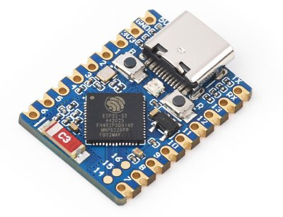
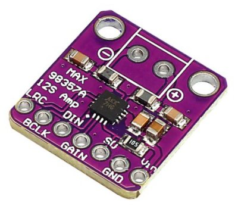
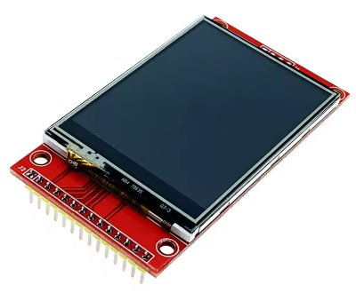

# Description
An demo program using minimal code to run a single screen game and watch rom on an esp32s3 via LCD Game Emulator.


# Components
- ESP32-S3-Zero
- Lcd: 240x320 2.4 inch SPI panel with ILI9341 driver
- Audio: Max98357 I2S Amp
- Speaker
- Mini push Buttons






# Wiring

## LCD ILI9341
- VCC:        ESP32 3.3v
- GND:        GND
- CS:         GND
- RESET:      GPIO 13
- DC:         GPIO 9
- MOSI        GPIO 11
- SCK:        GPIO 12
- LED:        ESP32 3.3v

## Max98357
- VIN:        ESP32 3.3v
- GND:        GND
- LRC (WS):   GPIO 4    
- BCLK:       GPIO 10
- DIN:        GPIO 6

## Buttons
- GAME A       GPIO 14
- GAME B       GPIO 5
- TIME         GPIO 3
- LEFT         GPIO 2
- RIGHT        GPIO 1
- ALARM        GPIO 7
- ACL          GPIO 8

# Roms
The roms must be in .gw format.

These can be created using LCD-Game-Shrinker.

https://github.com/bzhxx/LCD-Game-Shrinker

Below is a link to a guide describing how to use LCD-Game-Shrinker to generate the files.

https://gist.github.com/DNA64/16fed499d6bd4664b78b4c0a9638e4ef

# Building
Install the ESP-IDF framework. Current version is v5.4.1
https://docs.espressif.com/projects/esp-idf/en/stable/esp32s3/get-started/index.html

Make sure you can build the hello_world example project.

Download the code from this repo.

Use LCD-Game-Shrinker to generate a rom file for parachute. Rename the file to gnwparachute.gw, and place the file in the /gandw_single_screen/main/ directory.

Go back to /gandw_single_screen/ directory and open the terminal or cmd window in this directory.

## Linux
These instructions are for linux. If you are using windows follow the same steps you did when building the hello_world example project.

Run the export.sh script or get_idf if you set it up.

Export script should be similar to: 

```
. $HOME/esp/esp-idf/export.sh
```

Build: 
```
idf.py build
```

Then: 
```
idf.py -p /dev/ttyACM0 flash
```

You can also monitor by adding monitor at the end: 
```
idf.py -p /dev/ttyACM0 flash monitor 
```

Press Ctrl and ] to exit monitor.

If you are getting errors try a fullclean before building: 
```
idf.py fullclean
```

# Esp32
The code has been setup to run on a ESP32-S3-Zero dev board.

If you are using another ESP32-S3 you will need to setup PSRAM for your device and maybe alter the GPIO's used.

For the ESP32-S3-WROOM1 dev board you can setup PSRAM using 
```
idf.py menuconfig
```
Go to Component config → ESP PSRAM → Support for external, SPI-connected RAM → SPI RAM config
 and enable Octal Mode PSRAM.


# LCD Display

## Orientation

In the setup_lcd_spi function, there are 2 commands that you can use to change the screen orientation.

- esp_lcd_panel_swap_xy
- esp_lcd_panel_mirror

## Pixel Data

All the ILI9341 lcd panels i used required the pixel data to be byte swapped for the image to be displayed correctly.

I have swapped the byte order for the background and segment pixel data in lcd game emulator.

If the image displayed on your screen looks incorrect (wrong colours) you can remove the byte swap code.

In the file: /main/lcd_game_emulator/src/gw_sys/gw_romloader.c, comment or remove the byte swap for loop.

```
    gw_background = (unsigned short *)&GW_ROM[gw_head.background_pixel];

    // Byte swap background
    /* for (int i = 0; i < GW_SCREEN_HEIGHT * GW_SCREEN_WIDTH; i++) {
        gw_background[i] = (gw_background[i] >> 8) | (gw_background[i] << 8);
    } */
```
In the file: /main/lcd_game_emulator/src/gw_sys/gw_graphic.c:

Look for the rgb_multiply_8bits function.

Comment the byte swap version and uncomment the non byte swap version.

## Aspect Ratio

The lcd panel has a resolution of 320 x 240 and I have setup the code to use this resolution. 

To get closer to the aspect ratio of a game and watch you might want to use a smaller height value.

For example to use a resolution of 320 x 210 you need to do the following:

Generate the gw rom file in LCD-Game-Shrinker using this resolution.
In the file shrink_it.py set: 
```
gw_height=210
```
In the file: /main/lcd_game_emulator/src/gw_sys/gw_system.h set:
```
#define GW_SCREEN_HEIGHT 210
```
In gandw.c use:
```
#define DISPLAY_HEIGHT      240
#define RENDER_HEIGHT       210
#define RENDER_PADDING      15
```

The game screen will now be displayed centered vertically with black bars at the top and bottom.

# Audio

The volume level can be altered by a changing the value of the sample variable.

```
if (gw_audio_buffer[i] > 0) {
    sample = 2000;
}
```

# Acknowledgements

## LCD-Game-Emulator
https://github.com/bzhxx/lcd-game-emulator

## Retro-Go
https://github.com/ducalex/retro-go

The LCD-Game-Emulator version used by the project was copied from Retro-Go because it contains additional code to handle the loading of the gw files.


